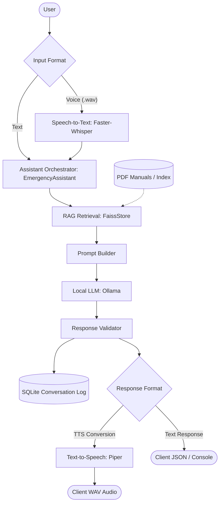

# CARE — Offline AI Emergency Assistance

CARE is a production-ready, safety-first, offline-first AI Emergency Assistant built for Electric Vehicle (EV) incidents. It utilizes RAG, a local LLM, Speech-to-Text transcription, and Text-to-Speech synthesis to provide immediate safety steps.

---

## 1. System Architecture

Below is the request-response workflow of the CARE system:



### Component Breakdown
1. **User / Speech Input**: User submits a text scenario or uploads a voice WAV file.
2. **Speech-to-Text (Faster-Whisper)**: Converts spoken WAV queries into text offline.
3. **Assistant Orchestrator**: Manages workflow states and verifies dependencies.
4. **RAG Retrieval (FAISS + Sentence-Transformers)**: Retrieves matching pages from indexed vehicle safety manuals.
5. **Prompt Builder**: Formats the LLM context, incorporating the system prompt and strict safety rules.
6. **Ollama LLM (LLaMA 3.2:3b)**: Generates clear, structured response steps locally.
7. **Response Validator**: Sanitizes outputs, injects emergency disclaimers for hazards, and prevents technical hallucinations if manual context is missing.
8. **SQLite Logger**: Archives all text queries and validated responses locally for audit logs.
9. **Piper TTS**: Synthesizes response text to WAV audio for voice outputs.

---

## 2. Folder Structure

```text
emergency_assistance/
│
├── app/                      # FastAPI Web Application
│   ├── __init__.py
│   └── api.py                # REST Endpoints (/, /health, /ask, /voice, /ingest)
│
├── assistant/                # AI Assistant Logic
│   ├── __init__.py
│   ├── emergency.py          # EmergencyAssistant & ResponseValidator
│   └── llm.py                # ModelManager (Ollama) & PromptBuilder
│
├── config/                   # Configuration Loader
│   ├── __init__.py
│   └── settings.py           # Settings dataclass & runtime environment validator
│
├── data/                     # Data Directory (Created on startup)
│   ├── raw/                  # Source PDFs (place EV rescue guides here)
│   ├── processed/            # Extracted pages & chunks metadata JSON
│   └── vector_store/         # Persistent FAISS index & metadata files
│
├── database/                 # Persistent Audit Database
│   └── repository.py         # SQLite logging repository & connection tester
│
├── logs/                     # System Logs
│   └── app.log               # Main structured application log
│
├── rag/                      # Document Ingestion & Embeddings
│   ├── __init__.py
│   ├── ingestion.py          # DocumentLoader (OCR enabled) & TextChunker
│   ├── schemas.py            # DocumentChunk & RetrievedChunk schemas
│   └── vector_store.py       # EmbeddingManager & FaissStore
│
├── speech/                   # Audio I/O Interfaces
│   ├── __init__.py
│   └── interfaces.py         # Faster-Whisper transcribers & Piper TTS speakers
│
├── tests/                    # Mocked Test Suite
│   ├── conftest.py
│   └── test_components.py    # Unit tests for all endpoints and components
│
├── .env.example              # Template for environment settings
├── main.py                   # Main CLI / Ingest / API launcher
└── requirements.txt          # Pinned dependency manifest
```

---

## 3. Installation Guide

### Prerequisites

#### A. Install Python 3.12
Download and install Python 3.12. Ensure "Add Python to PATH" is checked during installation.

#### B. Install FFmpeg (Required for audio transcription)
FFmpeg is a system binary, not a Python package.
- **Windows**: Open PowerShell as administrator and run:
  ```powershell
  winget install Gyan.FFmpeg
  ```
  Or download the build zip from [gyan.dev](https://www.gyan.dev/ffmpeg/builds/), extract it, and add the `bin` directory to your system Environment Variables `PATH`.
- **macOS**: `brew install ffmpeg`
- **Linux**: `sudo apt update && sudo apt install ffmpeg`

#### C. Install & Configure Ollama (Local LLM hosting)
1. Download Ollama from [ollama.com](https://ollama.com) and run the installer.
2. Start the Ollama server (run the app or execute `ollama serve`).
3. Download the default LLaMA 3.2:3b model:
   ```bash
   ollama pull llama3.2:3b
   ```

#### D. Install Piper (For text-to-speech WAV generation)
1. Download the Piper release binary for your OS from the [Piper GitHub Repository](https://github.com/rhasspy/piper).
2. Extract the archive and verify the executable works. Set the path to the executable in your `.env` configuration (e.g. `CARE_PIPER_COMMAND=C:/piper/piper.exe`).

---

### Project Setup

1. Open PowerShell / Command Prompt and navigate to the project directory:
   ```bash
   cd emergency_assistance
   ```
2. Create and activate a python virtual environment:
   ```bash
   python -m venv venv
   # On Windows:
   .\venv\Scripts\Activate.ps1
   # On Linux/macOS:
   source venv/bin/activate
   ```
3. Upgrade pip and install the dependencies:
   ```bash
   pip install --upgrade pip
   pip install -r requirements.txt
   ```
4. Copy the environment configuration:
   ```bash
   copy .env.example .env
   ```
5. Edit `.env` to configure your settings (Ollama URL, model name, and Piper paths).

---

## 4. How to Run the Application

The CARE application supports three separate command-line modes.

### A. Ingestion Mode (`--ingest`)
This scans your local EV rescue guides, runs OCR on scanned pages, structures chunk metadata, generates embeddings, and compiles the FAISS index:
1. Put your EV manufacturer manual PDF files inside `data/raw/`.
2. Execute the ingestion command:
   ```bash
   python main.py --ingest
   ```

### B. Interactive CLI Mode (`--cli`)
Run a text chat session directly in the command prompt. Excellent for low-memory environments or fast verification:
```bash
python main.py --cli
```
*Note: If the FAISS index or Ollama is missing, the CLI automatically falls back to safety warnings.*

### C. FastAPI Server Mode (Default)
Starts the REST API server to serve network clients:
```bash
python main.py
```
This runs the web server on the host and port defined in `.env` (default is `http://127.0.0.1:8000`).

---

## 5. API Usage & Endpoints

Open `http://127.0.0.1:8000/docs` in your browser to view the interactive OpenAPI documentation.

### A. GET `/` (Root Metadata)
- **Response**: `{ "project": "CARE Emergency Assistant", "status": "running" }`

### B. GET `/health` (Detailed Component Health)
Returns current connectivity and availability for database, vector indices, Ollama, Whisper, and Piper.
- **Response**:
  ```json
  {
    "status": "healthy",
    "components": {
      "sqlite": "connected",
      "faiss": { "status": "available", "chunks_loaded": 182 },
      "ollama": { "status": "healthy", "running": true, "model_exists": true, "message": "Ollama is running..." },
      "whisper": "available",
      "piper": "available"
    }
  }
  ```

### C. POST `/ask` (RAG Text Query)
- **Request JSON**: `{ "query": "Tesla Model Y battery is smoking" }`
- **Response JSON**: Returns response instructions, matching source files, page numbers, and a fallback flag.

### D. POST `/voice` (Speech-to-Speech)
- **Request**: Multipart Form Data containing an audio file (e.g. `file: UploadFile`).
- **Response**: A WAV audio file response containing the synthesized response steps. Includes the headers `X-Query-Text`, `X-Response-Text`, and `X-Used-Fallback`.

### E. POST `/ingest` (Trigger PDF Ingestion)
Allows programmatic/remote indexing of manual PDFs placed in the raw data directory.

---

## 6. Testing

Run the automated test suite using:
```bash
pytest
```
*Note: Tests run completely offline and mock all heavy models, API network requests, and database setups.*

---

## 7. Troubleshooting

* **Problem**: `ModuleNotFoundError: No module named 'faiss'`
  * **Cause**: On Windows, you must ensure `faiss-cpu` is installed, and that your Python environment is compatible (e.g. Python 3.12 with numpy < 2.0.0). Re-run `pip install -r requirements.txt`.
* **Problem**: `sqlite3.OperationalError: no such table: conversations`
  * **Solution**: Ensure you run `python main.py` or trigger the database initialization first. Ensure the directory path is writeable.
* **Problem**: Ollama connection warnings at startup
  * **Solution**: Verify the Ollama server is running by opening `http://127.0.0.1:11434` in your browser. Verify you pulled the model using `ollama pull llama3.2:3b`.
* **Problem**: Whisper/STT failures or sound device issues
  * **Solution**: Ensure FFmpeg is installed and added to your environment `PATH`. Check your system path variables.
